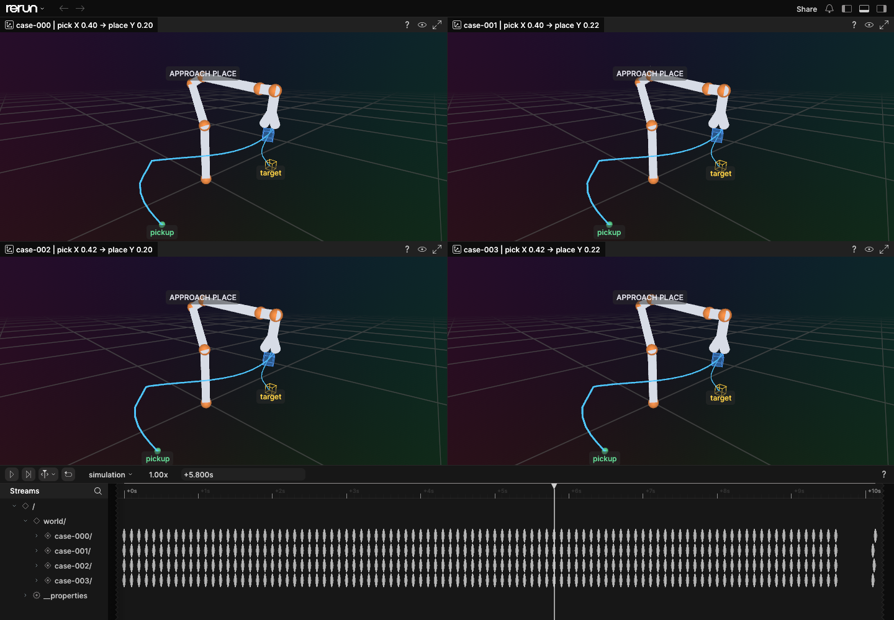
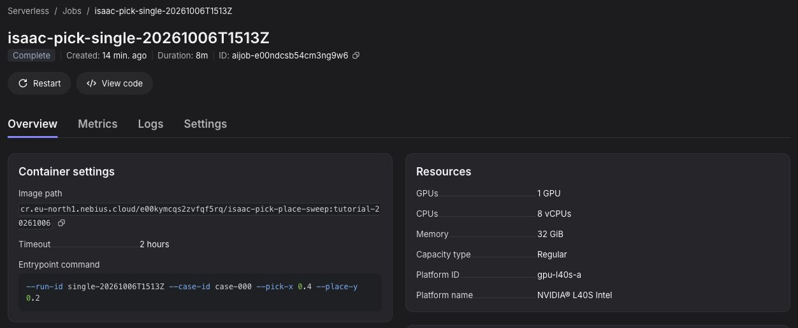
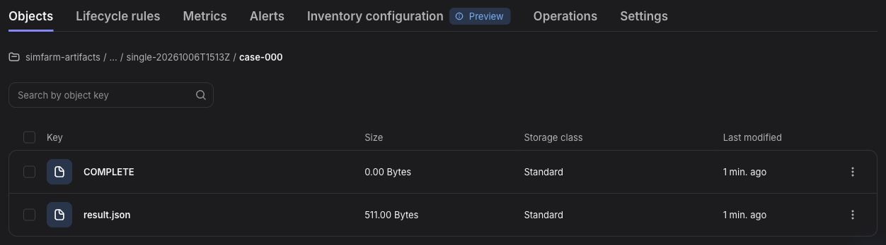
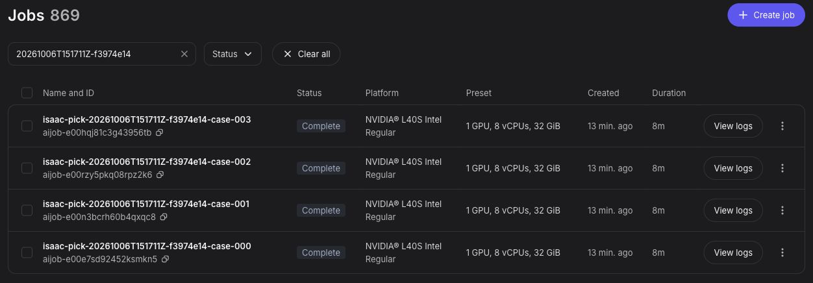
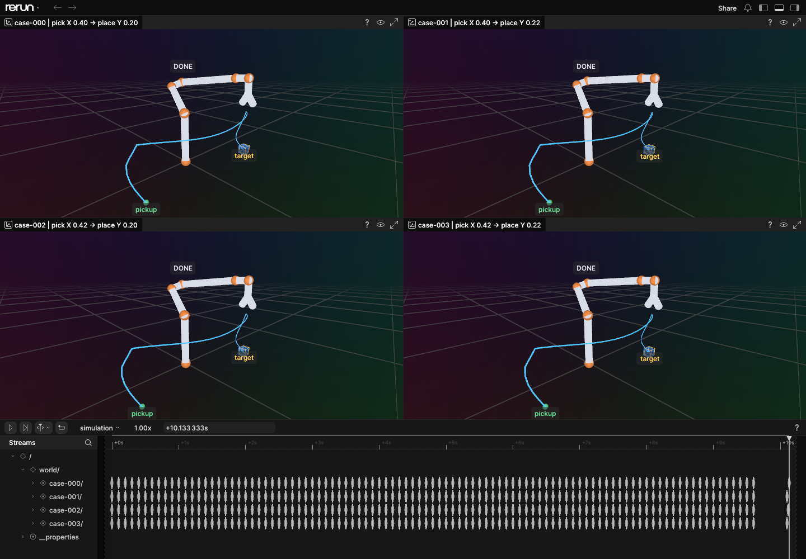

# Isaac Sim pick-and-place sweep

Run a Franka Panda pick-and-place task in Isaac Sim. Start with one Nebius AI Job, then use launch.py to submit one independent job for each combination in sweep.json. Every job uploads its measured result to Object Storage.

The default sweep changes the cube's pickup X and placement Y positions. A result can report robot-task failure even when its job completes: the job ran successfully, but the cube did not land near its target.

Four independent cloud jobs at 5.8 seconds of simulated time, replayed in Rerun. The simplified arm connects the Franka's link origins; the blue cube and cyan path show its recorded motion, with a green pickup marker and yellow placement target.

## Requirements

- Authenticated [Nebius CLI](https://docs.nebius.com/cli/), Docker, AWS CLI, and a [Container Registry](https://docs.nebius.com/container-registry/quickstart) in the same project as the jobs.
- An [Object Storage bucket](https://docs.nebius.com/object-storage/quickstart) and one [SecretStash secret](https://docs.nebius.com/serverless/jobs/manage) with payload keys named AWS_ACCESS_KEY_ID and AWS_SECRET_ACCESS_KEY. The access keys need permission to write to the bucket.
- An RTX-capable Serverless AI platform. This example uses gpu-l40s-a with preset 1gpu-8vcpu-32gb. Check its driver against [Isaac Sim 6.1 requirements](https://docs.isaacsim.omniverse.nvidia.com/6.1.0/installation/requirements.html) before running. H100 and A100 lack the RT cores Isaac Sim requires. The container also needs outbound access to NVIDIA's hosted assets.

## 1. Build and push the image

The committed Dockerfile starts from Isaac Sim 6.1.0 and runs run.py. The NVIDIA image already includes boto3. From the repository root, set IMAGE to your full Nebius registry path, then build and push:

~~~bash
cd robotics/isaac-pick-place-sweep
export IMAGE='cr.eu-north1.nebius.cloud/<registry-path>/isaac-pick-place-sweep:v1'
nebius registry configure-helper
docker build --platform linux/amd64 -t "$IMAGE" .
docker push "$IMAGE"
~~~

Use the [registry quickstart](https://docs.nebius.com/container-registry/quickstart) to find your registry path.

## 2. Set the bucket and secret

Use your bucket's region and the selector for the single secret containing both S3 payload keys:

~~~bash
export S3_BUCKET='<bucket-name>'
export REGION='eu-north1'
export S3_SECRET='<secret-selector>'
export S3_ENDPOINT_URL="https://storage.$REGION.nebius.cloud"

aws configure --profile isaac-sweep
export AWS_PROFILE=isaac-sweep
aws s3 ls "s3://$S3_BUCKET" --endpoint-url "$S3_ENDPOINT_URL"
~~~

Enter the bucket access keys when aws configure prompts you, or use an existing AWS CLI profile with access to the bucket. The commands below pass the secret selector to Nebius; they never put key values in job arguments.

## 3. Run one pick-and-place job

This first case uses the positions in [NVIDIA's 6.1 example](https://docs.isaacsim.omniverse.nvidia.com/6.1.0/core_api_tutorials/tutorial_core_adding_manipulator.html). The image's entrypoint runs run.py, so the job only supplies its arguments. If your project has multiple subnets, add --subnet-id with your subnet ID to this command and the sweep command below.

~~~bash
export RUN_ID="single-$(date -u +%Y%m%dT%H%M%SZ)-$RANDOM"
export CASE_ID='case-000'
nebius ai job create \
  --name "isaac-pick-$RUN_ID" \
  --image "$IMAGE" \
  --async \
  --platform gpu-l40s-a --preset 1gpu-8vcpu-32gb --timeout 2h \
  --env ACCEPT_EULA=Y --env PRIVACY_CONSENT=Y \
  --env "S3_BUCKET=$S3_BUCKET" \
  --env "S3_ENDPOINT_URL=$S3_ENDPOINT_URL" \
  --env "AWS_DEFAULT_REGION=$REGION" \
  --env S3_PREFIX=isaac-pick-place \
  --env-secret "AWS_ACCESS_KEY_ID=$S3_SECRET" \
  --env-secret "AWS_SECRET_ACCESS_KEY=$S3_SECRET" \
  --args "--run-id $RUN_ID --case-id $CASE_ID --pick-x 0.4 --place-y 0.2"
~~~

Copy the printed job ID into JOB_ID. The `--async` flag returns after submission, so you can follow the job and inspect its result:

~~~bash
export JOB_ID='<job-id-from-output>'
nebius ai job logs "$JOB_ID" --follow
nebius ai job get "$JOB_ID" --format json
aws s3 ls "s3://$S3_BUCKET/isaac-pick-place/$RUN_ID/$CASE_ID/" \
  --endpoint-url "$S3_ENDPOINT_URL"
aws s3 cp "s3://$S3_BUCKET/isaac-pick-place/$RUN_ID/$CASE_ID/result.json" ./result.json \
  --endpoint-url "$S3_ENDPOINT_URL"
python3 -m json.tool result.json
~~~

In the Nebius console, open **Serverless AI → Jobs** and search for your job name or ID. Its **Overview** shows the image, arguments, and terminal state. Account and run identifiers are redacted in the screenshots:

The case prefix should contain result.json and an empty COMPLETE object. COMPLETE is written after the result upload. In result.json, controller_done tells you whether the robot controller finished; final_cube_position_m and the XY/Z errors report where the cube ended. The success field is true only when the controller finished and the cube landed within 8 cm of its target. A Nebius job state of COMPLETED does not by itself mean the robot succeeded.

Open **Object Storage → your bucket → isaac-pick-place → your run ID → case-000** to see the same two objects:

## 4. Run the four-job sweep

The two arrays in sweep.json form a grid: two values on each axis create four separate jobs. Inspect the requests, then submit:

~~~bash
python3 launch.py --image "$IMAGE" --bucket "$S3_BUCKET" \
  --region "$REGION" --s3-secret "$S3_SECRET" --dry-run
python3 launch.py --image "$IMAGE" --bucket "$S3_BUCKET" \
  --region "$REGION" --s3-secret "$S3_SECRET"
~~~

The launcher submits without waiting for each simulation, prints each job ID and S3 path, and writes `runs/<run-id>/jobs.jsonl`. Earlier IDs remain available if a later submission fails. Use a job ID to check logs and status as above. To list every result after the jobs finish:

~~~bash
export RUN_ID='<run-id-from-launch-output>'
aws s3 ls "s3://$S3_BUCKET/isaac-pick-place/$RUN_ID/" --recursive \
  --endpoint-url "$S3_ENDPOINT_URL"
~~~

Each case should have result.json and COMPLETE. Compare the success and error fields across cases; the sweep is a small example, not a robot benchmark.

Search for the sweep's run ID in **Jobs** to see all four independent jobs together:

## 5. Optional: replay the motion in Rerun

Add `--record-motion` to the sweep command to save `trajectory.json` alongside each result. It records cube poses, robot-link positions, and task phases at 10 Hz, plus the initial and settled final poses. Rerun runs on your computer; the cloud image needs no additional packages.

~~~bash
python3 launch.py --image "$IMAGE" --bucket "$S3_BUCKET" \
  --region "$REGION" --s3-secret "$S3_SECRET" --record-motion
~~~

After the jobs finish, download the new run and open the recording:

~~~bash
export RUN_ID='<run-id-from-launch-output>'
aws s3 sync "s3://$S3_BUCKET/isaac-pick-place/$RUN_ID/" "results/$RUN_ID/" \
  --endpoint-url "$S3_ENDPOINT_URL"
python3 -m venv .venv-rerun
source .venv-rerun/bin/activate
python -m pip install rerun-sdk==0.38.1
python visualize.py results/"$RUN_ID"/case-* --output results/pick-place.rrd
rerun results/pick-place.rrd
~~~

Press **Play** or scrub the **simulation** timeline to inspect pickup, lift, transfer, and release. Each panel is a separate job, aligned by simulated time. The arm is a pose visualization rather than a photorealistic Isaac render. Only jobs submitted with `--record-motion` produce replay data. See [Rerun's viewer guide](https://rerun.io/docs/getting-started/configure-the-viewer/navigating-the-viewer) for navigation controls.

The same four jobs after placement, at 10.133 seconds. The cube is near the yellow target in each case; use `result.json` for the measured placement errors.

## Verified run

On October 6, 2026, the tutorial was run end to end: build and push, submit the single job, submit the four-job sweep, and download and inspect all five results. The Nebius console screenshots are from that run.

The Isaac Sim 6.1.0 image was built from this Dockerfile and pushed with digest `sha256:8df53e77f57a8355240acc0d078e64ee18b1afd091a74245c228406b16c0b972`. On `gpu-l40s-a`, single job `aijob-e00ndcsb54cm3ng9w6` completed with `success: true` and 1.17 cm XY error. Sweep run `20261006T151711Z-f3974e14` submitted four jobs in about 20 seconds; all four completed with `success: true` and 1.17–1.27 cm XY error. Every case had both S3 objects. Each simulation took about eight minutes after the container started; provisioning and image pulling added about five minutes on this run.

The optional recording path was also tested in a fresh four-job sweep, `20261006T154718Z-659d897b`, using image digest `sha256:2369367d29e30c9baa3f4f1c28d0a4fc466d2a4b9b947be7ff1238efbc60955e`. All four jobs completed with `success: true`, 1.17–1.27 cm XY error, and all three S3 objects. Each trajectory contained 98 measured frames covering about 10.1 seconds; its final cube pose matched `result.json`. The Rerun screenshots show these recordings. They contain no account, bucket, job, or run identifiers.

The worker reported an NVIDIA L40S with 46,068 MB VRAM and driver 580.173.02. NVIDIA lists Linux driver 595.58.03 in its [6.1 requirements](https://docs.isaacsim.omniverse.nvidia.com/6.1.0/installation/requirements.html). This headless task passed on the tested worker, but its driver is below NVIDIA's listed version.

## Optional customization

Edit sweep.json for other pickup X or placement Y values. Change the Dockerfile to add packages or assets, or change run.py to edit the task; push a new image tag after either change. To use another RTX platform or Nebius CLI profile, change the platform and preset or add `--profile` to the commands.

## Optional local GPU check

On a Linux host with a compatible RTX GPU, run one case without S3:

~~~bash
docker run --name isaac-pick-local --gpus all --shm-size 16g \
  -e ACCEPT_EULA=Y -e PRIVACY_CONSENT=Y \
  "$IMAGE" --run-id local --case-id case-000 \
  --pick-x 0.4 --place-y 0.2 --local
docker cp isaac-pick-local:/tmp/isaac-results/result.json ./result.json
docker rm isaac-pick-local
~~~

## Troubleshooting

| Symptom | Check |
| --- | --- |
| Container fails before simulation | RTX GPU, NVIDIA driver, EULA and privacy consent, and access to hosted assets. |
| Image cannot be pulled | Confirm the image tag exists in the same project's registry. |
| Job fails after simulation | Bucket write permission and the two SecretStash payload key names. COMPLETE should be absent after a failed upload. |
| Job completes with success false | Check controller_done, the final cube position, and XY/Z errors. |
