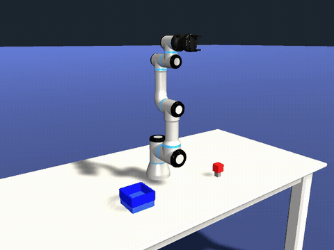
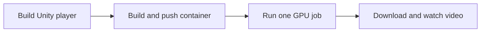
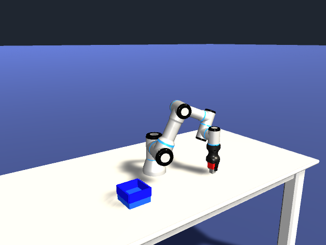
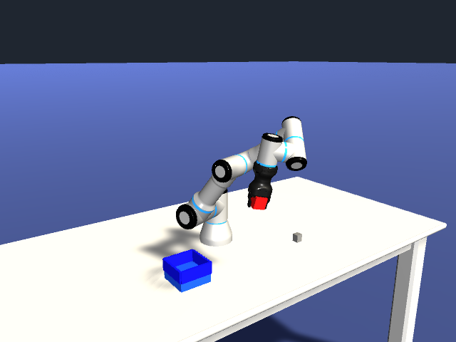
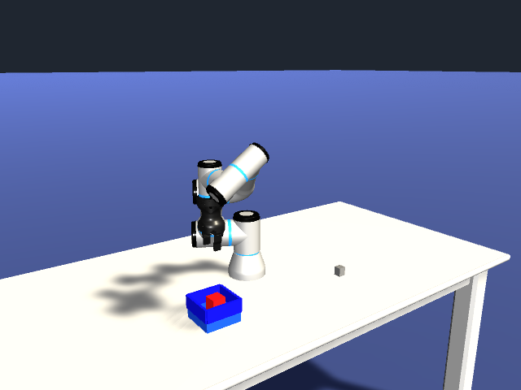

# Unity pick-and-place on Serverless

Run one GPU job that makes a UR3 pick up a red cube and place it in a blue tray.
Unity simulates the robot, ROS 2 carries observations and commands, and a Python
controller uses camera detection and a shipped learned joint servo to move the arm.

[](assets/pick-place.mp4)

**[Watch the final video: 53 seconds at 15 FPS](assets/pick-place.mp4).**
This is an actual Nebius run, with physical finger contact and GPU rendering.



## What you need

- Unity Editor **6000.6.5f1**, licensed and installed with Linux Build Support (Mono).
- Docker, an authenticated container registry, and the Nebius CLI configured for your project.
- A writable Nebius Object Storage bucket and AWS CLI credentials for downloading results.
- Python 3 and FFmpeg (`ffmpeg` and `ffprobe`) for the result check.

The assets and model are public; no model training is required. Unity setup is a
one-time local step. Nebius requires an account and charges for compute/storage.
Run the commands below from `robotics/unity-pick-and-place-demo`.

## 1. Build the Unity player

See [Unity setup](docs/build-unity.md) for installation, pinned sources and build details.
Start with fresh `project/` and `build/` directories:

```bash
python3 prepare.py
export UNITY_EDITOR='/path/to/Unity/Editor/Unity'
# macOS: /Applications/Unity/Hub/Editor/6000.6.5f1/Unity.app/Contents/MacOS/Unity
export UNITY_BUILD_DIR="$PWD/build"
"$UNITY_EDITOR" -batchmode -quit -projectPath "$PWD/project/ArmRobot" \
  -executeMethod DemoBuild.Linux -logFile "$PWD/build.log"
```

The build keeps camera rendering enabled. Keep the complete `build/` directory;
the container runs this player, without the Editor or its credentials.

## 2. Build and push the container

Use your existing registry login:

```bash
export NEBIUS_IMAGE='<your registry>/ur3:pick-v1'
docker build --platform linux/amd64 -t "$NEBIUS_IMAGE" .
docker push "$NEBIUS_IMAGE"
```

Keep the image reference under 64 characters for the tested Nebius CLI.
Unity, the ROS endpoint, recording and controller all run in this container.
Apple Silicon can build the image; running Unity requires native Linux x86-64
with NVIDIA graphics. [Optional local GPU test](docs/advanced.md#optional-local-gpu-check).

## 3. Submit and inspect

Use the bucket's **resource ID** here, not its S3 name:

```bash
export NEBIUS_BUCKET_ID='<bucket resource ID>'
export RUN_ID="pick-$(date -u +%Y%m%dT%H%M%SZ)"
bash job.sh dry-run
bash job.sh submit
```

Copy the job ID from the submission output:

```bash
export JOB_ID='<job ID>'
nebius ai job get "$JOB_ID"
nebius ai job logs "$JOB_ID" --follow
```

The job uses one L40S (`gpu-l40s-a`, `1gpu-8vcpu-32gb`) and a 15-minute timeout.
The default simulation limit is 180 seconds; it exits shortly after placement.
Use a fresh run ID each time. All ROS traffic stays inside the container.
For a project or subnet override, set `NEBIUS_PROJECT_ID` or `NEBIUS_SUBNET_ID`.

## 4. Download, check and watch

After the job reaches `COMPLETED`, use your bucket's **S3 name** and regional endpoint:

```bash
export S3_BUCKET='<bucket S3 name>'
export S3_ENDPOINT_URL='<region Object Storage endpoint>'
aws --endpoint-url "$S3_ENDPOINT_URL" s3 cp \
  "s3://$S3_BUCKET/unity-articulations/$RUN_ID/" "results/$RUN_ID/" --recursive
python3 check.py "results/$RUN_ID"
```

Open `results/$RUN_ID/preview.mp4` in your video player.

| Output | What you get |
|---|---|
| `preview.mp4` | The complete task, rendered at 640×480 and 15 FPS |
| `result.json` | Success, cube motion, placement error and ROS message counts |
| `rosbag/` | Recorded camera observations, robot feedback and commands |

The check rejects missing images, invalid trajectories, empty recordings,
CPU rendering and incomplete physical placement. Failures retain available logs
and partial results. [Additional evidence and troubleshooting](docs/advanced.md).

| Grasp | Carry | Place |
|:---:|:---:|:---:|
|  |  |  |

The simplified cookbook was verified on Nebius: **53.9 cm of cube motion and
7.1 mm placement error**, with a 15 FPS NVIDIA-rendered video. The bundled preview
shows the earlier verified run. See [validation history](docs/advanced.md#validation-history)
and [validation.json](validation.json) for both runs and their image digests.

This demo assumes one red cube, a calibrated pickup surface and an empty tray.
Camera detection, inverse kinematics and the gripper sequence are programmed;
the learned model controls joint velocities. [Adaptation and retraining](docs/advanced.md).

## Where to look

| Location | Purpose |
|---|---|
| `prepare.py`, `Dockerfile`, `job.sh`, `check.py` | The four tutorial steps |
| `unity/` | Scene setup, unattended simulation and Linux build source |
| `runtime/` | Container runner, ROS controller, camera detection and shipped model |
| `docs/` | Unity setup and advanced explanations |
| `assets/` | The tutorial video and screenshots |
| `tests/`, `tools/` | Developer checks and optional model retraining |
| `validation.json` | Current and historical cloud evidence |

Generated `project/`, `build/` and `results/` directories are ignored by Git.
