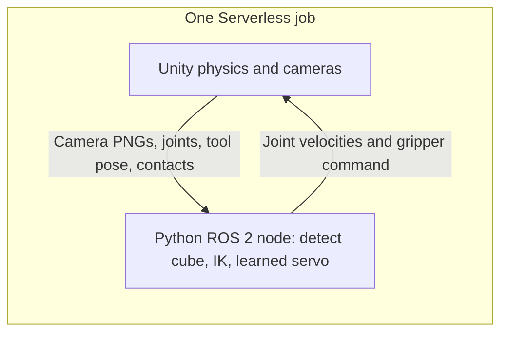
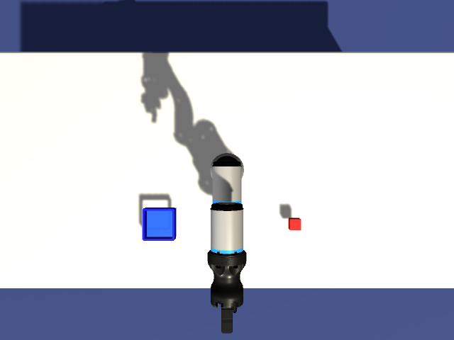

# How the demo works

Run all commands below from the cookbook directory. Retraining is optional; the tutorial uses the shipped model.

## Control contract and adaptation



ROS traffic stays inside the container through the TCP endpoint on
`127.0.0.1:10000`. The camera supplies the pickup position; joint and contact
feedback guide the remaining sequence.



*The controller's camera input, extracted from the recorded ROS bag. Red pixels
locate the cube on the calibrated pickup plane; this view is separate from the
video camera.*


Joint order is `Base, Shoulder, Elbow, Wrist1, Wrist2, Wrist3`. Observations are
radians and velocities are rad/s, bounded to ±10 degrees/s. ROS control runs near
10 Hz; commands echo observation timestamps. Unity rejects malformed or stale
commands and integrates valid velocity into persistent articulation drive targets.
The tool pose is the finger grasp centre. Coordinates are ROS FLU metres in
`base_link`; Unity RUF `(x,y,z)` becomes `(z,-x,y)`.

| Topic | Message |
|---|---|
| `/joint_states` | `sensor_msgs/JointState` |
| `/tool_pose` | `geometry_msgs/PoseStamped` |
| `/camera/image/compressed` | `sensor_msgs/CompressedImage`, PNG at 5 Hz |
| `/joint_commands` | `trajectory_msgs/JointTrajectory`, one velocity point |
| `/gripper_command`, `/gripper_contacts` | `std_msgs/Float64`, `std_msgs/Float64MultiArray` |
| `/task_phase` | `std_msgs/String` |
| `/goal`, `/tool_position`, `/cube_ground_truth` | `geometry_msgs/PointStamped`; cube truth is verification only |

`runtime/pick-policy/servo.onnx` is a 6→64→64→6 tanh MLP trained on bounded proportional
joint control (24,000 samples, seed 71). The task sequence uses calibrated camera
localization, scene-derived pose IK and measured finger contact. It has no general
collision planner or recovery from a dropped cube.

To adapt, change the scene and camera calibration in `unity/PickScene.cs`, detector in
`runtime/perception.py`, and task poses/sequence in `runtime/policy_node.py`. Re-export kinematics
for another robot; do not assume the shipped model/poses support a different arm:

```bash
export KINEMATICS_PATH="$PWD/runtime/pick-kinematics.json"
"$UNITY_EDITOR" -batchmode -quit -projectPath "$PWD/project/ArmRobot" \
  -executeMethod DemoBuild.ExportKinematics -logFile "$PWD/kinematics.log"
uv venv --python 3.11 .venv
uv pip install --python .venv/bin/python numpy==2.4.6 onnx==1.23.2 \
  onnxruntime==1.31.0 pillow==10.4.0
OPENBLAS_NUM_THREADS=1 VECLIB_MAXIMUM_THREADS=1 .venv/bin/python tools/train_servo.py
.venv/bin/python tests/test_policy.py
python3 tests/test_task.py
python3 tests/test_demo.py
```

For a downloaded run, replay ONNX outputs and compare measured Unity kinematics:
`.venv/bin/python tests/test_policy.py "results/$RUN_ID"`. To check ROS contracts and
deserialize the bag inside the image:

```bash
docker run --rm --platform linux/amd64 -i --entrypoint bash \
  -e BAG_PATH="/results/$RUN_ID/rosbag" -v "$PWD/results:/results" "$NEBIUS_IMAGE" \
  -c 'source /opt/ros/humble/setup.bash; python3 -' < tests/test_ros.py
```

## Troubleshooting

- ROS constructor build errors: verify the `ROS2` scripting define and recompile.
- Startup or stale commands: inspect `endpoint.log` and `policy.log`.
- Kinematics mismatch: check grasp-centre export and metres/radians before tuning.
  Avoid the upstream `ResetGripToOpen()` helper: it writes the gripper transform
  using finger-local coordinates. This demo commands the gripper drives directly.
- Task stalls: inspect phases, pixel detections and finger-contact records. Keep
  the cube mass, finger drive force and pedestal clearance physically compatible.
- Display startup: enable NVIDIA graphics capabilities; inspect `display.log`,
  `xorg.log` and `graphics.log`. Do not set `UseDisplayDevice=None` on the tested
  Nebius driver; its virtual-display mode rejects that setting.
- Uniform images: retain graphics and complete player libraries; inspect Unity logs.
- Output errors: use a fresh ID and verify bucket write access.


## Evidence files

| Artifact | Evidence |
|---|---|
| `preview.mp4`, `images/*.png`, `frames.csv` | 640×480, timestamped 15 FPS video |
| `objects.csv`, `task.json` | Cube lift, finger contacts, tray placement, completion |
| `joints.csv`, `applied.csv` | Measured joints/grip and commands Unity applied |
| `perception.jsonl`, `camera.json` | Pixel detections, calibration and estimated pickup position |
| `policy.jsonl`, `policy-metadata.json` | ONNX inputs/actions, task phases, model checksum, latency |
| `rosbag/` | Camera, poses, joints, gripper, contacts, task phases and commands |
| `result.json`, `simulation.json` | Checked summary and simulation completion |
| `renderer.json`, `graphics.log`, `xorg.log` | Actual Unity GPU/API and display diagnostics |
| `*.log` | Endpoint, policy, recorder, Unity and video encoding logs |

The checker accepts NVIDIA hardware rendering on local GPUs; L40S is the cloud
default and the GPU used for the recorded validation. It rejects CPU rendering,
missing images, choppy/incomplete capture, invalid trajectories,
nonfinite numeric CSV values, unordered timestamps, empty ROS topics, command
mismatches and tasks without lift, contact, carry,
release and tray placement. Watch the video as well. A failure keeps partial
artifacts and logs; it is not relabelled as success.

## Optional local GPU check

```bash
mkdir -p results
export LOCAL_RUN="pick-local-$(date -u +%Y%m%dT%H%M%SZ)"
docker run --rm --gpus all -e RUN_SECONDS=180 -e OUTPUT_DIR="/results/$LOCAL_RUN" \
  -v "$PWD/results:/results" "$NEBIUS_IMAGE"
python3 check.py "results/$LOCAL_RUN"
```

## Validation history

[validation.json](../validation.json) records image digests, job IDs, measurements, and failed attempts.
Its `historical_records` section preserves the earlier reaching and scripted validation records under their original filenames. The current checker supports pick-and-place only; the old model and training code have been removed.

The bundled video is the verified 2026-10-09 GPU run: 53.3 cm of cube motion, 5.5 mm placement error, and 791 frames at 15 FPS. The simplified version, including the later publication-failure and CSV fixes, was verified in job `aijob-e00xn56q80jpm8q3by` using image `ur3:1009simple`: 53.9 cm of cube motion, 3.8 mm placement error, and a 53.5-second video at 15 FPS. All 829 artifacts passed the current checker, every ROS message deserialized, and recorded policy actions replayed correctly. The completed GPU instance was removed. The bundled preview remains the earlier verified run.

The reorganized cookbook was subsequently rebuilt, pushed and tested on Nebius
in job `aijob-e00ypv9z5fr79zzr86`, using image `ur3:1009org`. It completed with
53.9 cm of cube motion and 7.1 mm placement error. The downloaded 53.3-second video
has 800 frames at 15 FPS; all 826 artifacts passed verification, all ROS messages
deserialized, and the recorded learned actions replayed correctly. The GPU
instance was automatically removed. Exact digests and measurements are recorded
in `validation.json`; the bundled preview remains the earlier verified run.
